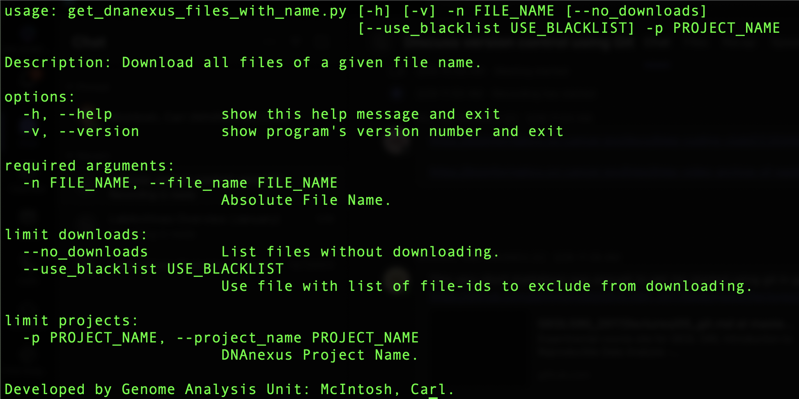

# get_dnanexus_files_with_name.py
This script will download any file of a given name from one specified DNAnexus project or all projects. The user must have access to one or more projects to work.

## Get Help
```BASH
python3 get_dnanexus_files_with_name.py --help
```



## Get Version

```BASH
python3 get_dnanexus_files_with_name.py --version
```


## Download file/s for a given file name for a single *DNAnexus* project.
***-n $FILE_NAME*** or **--*file_name $FILE_NAME*** : Specify name i.e *file.txt*, but **.txt* not permitted.

```BASH
python3 get_dnanexus_files_with_name.py \
--project_name $DNANEXUS_PROJECT  \
--file_name $FILE_NAME
```

## no_downloads option, report file/s for a given file name for a single *DNAnexus* project.
***--no_downloads*** : No files will be downloaded, but locations, if any, will be reported (optional parameter).

```BASH
python3 get_dnanexus_files_with_name.py \
--project_name $DNANEXUS_PROJECT  \
--file_name $FILE_NAME \
--no_downloads

```

## Backlist option, all downloaded and all added to excludelist
***--use_exclude_file*** : Files for a give set of *file-id* will not be downloaded, but all others, will be downloaded and added to the excludelist file. This will ensure that the file will be downloaded once. Downloaded files will be pre-appended with the *file-id*, so, if the *file-id* is "file-XXXXXX"
 and the filename was "file.txt" then the downloaded file name will be file-XXXXXX_file.txt. This ensures that the files are uniquely named.

```BASH
python3 get_dnanexus_files_with_name.py \
--project_name $DNANEXUS_PROJECT  \
--file_name $FILE_NAME \
--use_exclude_file $EXCLUDE_FILE_PATH
```

## Script will explore all accessible *DNAnexus* projects.
```BASH
python3 get_dnanexus_files_with_name.py \
--file_name $FILE_NAME \
```

**Not enabled yet.**
