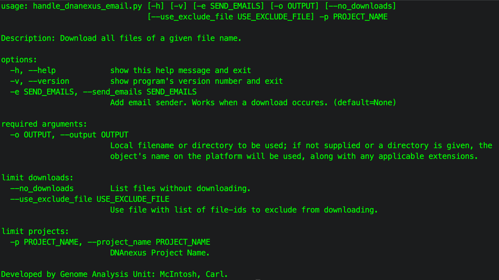
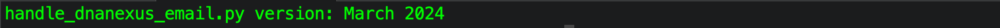

<p style="text-align: center;"><font size="+4">handle_dnanexus_email.py</font></p>


## Objective
We would like to be able to directly email a notice from a DNAnexus App or Applet, but there is no easy way provided. We developed this script to download the email notice and then to email it to designated recipients. There are at least three requirements:

1. SMTP email capabilities via python [documentation link](https://docs.python.org/3/library/smtplib.html).
2. Applet generates an email with a given syntax (example in section ***Email Syntax***) that is able to place the email in a fixed location.
3. The fixed location for each project would be: *** \< DNAnexus Project \>:/email/pending/\< Job-ID \>_notice.email.txt*** where this script will search.

## Algoritm Overview
This script will have the following actions:

1. For a designated DNAnexus project, the script will search for files at location: ***\< DNAnexus Project \>:/email/pending***
2. A cron job periodically runs *handle_dnanexus_email.py* which will have the following actions:
	1. Download email files from ***\< DNAnexus Project \>:/email/pending/\< Job-ID \>_notice.email.txt*** a computer with SMTP capabilities.
	2. Move email notice from ***\< DNAnexus Project \>:/email/pending*** to ***\< DNAnexus Project \>:/email/sent/***
	3. Email contents of ***$PATH/\< Job-ID \>_notice.email.txt***
	4. Email the sender and Exit.

## Email Syntax (*Requirement*)
File nomenclature should follow something like ***<Job-ID>_notice.email.txt*** (i.e. *job-yyyy_notice.email.txt*). Pre-appending the file name with the job-id will uniquely the email.

 As an example, an email notice will have a minimum of 3 lines:
```TEXT
Email To: thing1@gmail.com,thing2@gmail.com,thing3d@gmail.com
Subject: Some useful single-line subject on line 2.
Some useful email letter content of one or more subsequent lines.
```
***Email To:*** single-line has comma separated emails on the first line.
***Subject:*** single-line with an informative subject on the second line.
***Email Message*** is a single- or multi-line starting on the third line.

## Email Placement on DNAnexus (*Requirement*)
This script will search for files located ***$DNANEXUS_PROJECT:/email/pending***, so placement is critical for this script to work. Empty directories can be generated though the DNAnexus website or via command-line as follows:
```BASH
DNANEXUS_PROJECT=<Project Name or ID>
dx mkdir --parents $DNANEXUS_PROJECT:/email/pending
dx mkdir --parents $DNANEXUS_PROJECT:/email/sent
```

## Get command-line help
```BASH
python3 handle_dnanexus_email.py --help
```


## Get version information
```BASH
python3 handle_dnanexus_email.py --version
```


## Creating test directories and test email files
Using a text editor generate a test email following the example in section above **Email Syntax**. Only files located on DNAnexus at location ***$DNANEXUS_PROJECT:/email/pending*** will be "operated" on. Additionally, generate the required directories at the root level using the ***dx mkdir*** as directed below:

```BASH
DNANEXUS_PROJECT=<Project Name or ID>
dx upload ../TestFiles/job-xxxx_notice.email.txt --destination=$DNANEXUS_PROJECT:/email/pending/job-xxxx_notice.email.txt
dx upload ../TestFiles/job-yyyy_notice.email.txt --destination=$DNANEXUS_PROJECT:/email/pending/job-yyyy_notice.email.txt
```
We've generated this script for the case-use that a cron job will run the script periodically to search for newly generated email from a DNAnexus App or Applet. Below are examples on how to use the script.

## Minimal run with option ***--no_downloads*** option.
This will simply list available files in directory ***$DNANEXUS_PROJECT:/email/pending*** on DNAnexus.

- ***\-\-project_name*** (required) - DNAnexus Project name or Project ID.
- ***\-\-no_downloads*** (optional) - No downloads, but files found on DNAnexus at location ***$DNANEXUS_PROJECT:/email/pending*** will be listed.
- No downloads take place.
- No emails are sent.

```BASH
python3 handle_dnanexus_email.py --project_name $DNANEXUS_PROJECT --no_downloads
```

## Full run example
Below is the best use case:

- ***\-\-use_exclude_file*** (optional) start by providing an empty file and as files are downloaded, a list of file-id will be written and will prevent files from being downloaded again. You can create an empty file with the touch command.
- ***\-\-send_email*** (optional) - An attempt to send out emails will be made. If used with ***--no_downloads***, no emails will be sent.
- email messages on DNAnexus at location ***$DNANEXUS_PROJECT:/email/pending*** will be moved to ***$DNANEXUS_PROJECT:/email/sent***

```BASH
# Generate blank exclude file.
touch ./exclude.txt # if no existing exclude.txt file exists.
python3 handle_dnanexus_email.py \
--project_name $DNANEXUS_PROJECT \
--use_exclude_file ./exclude.txt \
--send_email test@gmail.com

# Check if emails are moved from 'pending' to 'sent' directory locations.
dx ls -l $DNANEXUS_PROJECT:/email/pending
dx ls -l $DNANEXUS_PROJECT:/email/sent
```
## Example of download email notice, but no email is sent.

```BASH
python3 handle_dnanexus_email.py --project_name $DNANEXUS_PROJECT
```
## Other Items
- An email copy will be sent to the sending email address.
- If an invalid email address/s is provided, the email will be noted in the output and an email with "ERROR" in the subject will be sent to the sending email address.
